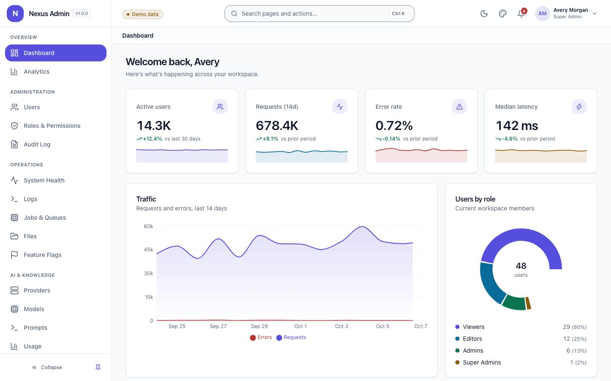
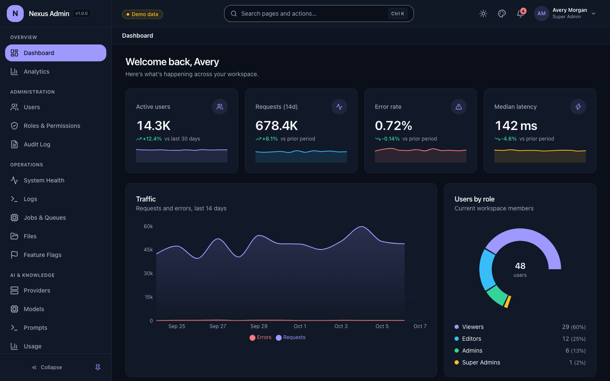
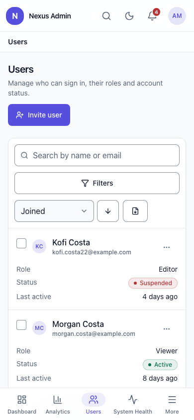

# Nexus Admin

Nexus Admin is a reusable, themeable, mobile first admin application and marketing UI system designed for independent deployment across SaaS, AI, RAG, research, enterprise, internal, and client projects.

It is intended to be usable in three ways:

1. As an internal reusable platform for your own projects.
2. As an open source framework or starter kit.
3. As a commercial product distributed through marketplaces such as CodeCanyon or directly to clients.

## Reference stack

The reference implementation uses:

- Next.js
- React
- TypeScript
- Tailwind CSS
- shadcn/ui
- TanStack Query
- TanStack Table
- React Hook Form
- Zod
- Framer Motion
- GSAP and ScrollTrigger for cinematic landing pages
- Recharts for dashboard visualization
- Lucide icons

The backend is intentionally decoupled. FastAPI, Flask, Laravel, Django, Node, Go, or any other backend can connect through the API contract.

## Core principles

- Independent deployment per application
- Sidebar first desktop navigation
- Top bar for account, global actions, search, notifications, and theme controls
- Breadcrumb below the top bar
- Real mobile app behavior on small screens
- Bottom navigation for small mobile information architectures
- Mobile drawer or full screen navigation for larger applications
- Theme presets with deep customization
- Strong card and surface hierarchy
- Advanced tables, filters, forms, charts, notifications, and feedback patterns
- Built in dark mode and accessibility
- PWA ready
- Reusable landing page system with advanced motion
- Modular feature registration
- Commercial distribution readiness

## Quick start

```bash
pnpm install
pnpm dev
```

One command starts everything and opens the admin in your browser:

| App | URL |
| --- | --- |
| Admin dashboard | http://localhost:3000 |
| Landing site (marketing) | http://localhost:3200 |

The admin has a **Landing site** entry in the account menu (top right) and in the command palette (`Ctrl/⌘ K`); both open the marketing site in a new tab. The marketing site has an **Admin demo** link that opens the admin. Use `pnpm dev --no-open` to skip opening the browser, `pnpm dev --only=admin` (or `--only=marketing`) to run a single app. Optional: `cp .env.example apps/admin/.env.local`.

Sign in at `/login` with the demo accounts (demo mode only):

| Email | Access |
| --- | --- |
| `admin@example.com` | everything |
| `editor@example.com` | read access plus files |
| `viewer@example.com` | dashboard, analytics, health |

Billing is an optional module: set `modules.billing: false` in `apps/admin/src/lib/app-config.ts` if your product does not charge customers.

Any password of 8+ characters works in demo mode. **Demo mode uses an in-memory API and a non-secret marker cookie. It is not a security control. Set `NEXT_PUBLIC_API_BASE_URL` (or `NEXT_PUBLIC_DEMO_MODE=false`) for real deployments.**

## Scripts

| Command | What it does |
| --- | --- |
| `pnpm dev` | Run the admin and the marketing site together (opens the admin) |
| `pnpm build` / `pnpm start` | Build and serve the admin app |
| `pnpm typecheck` | TypeScript across every workspace package |
| `pnpm lint` | ESLint (Next.js core-web-vitals + TypeScript rules) |
| `pnpm test` | Vitest unit and component tests |
| `pnpm test:e2e` | Playwright end-to-end tests (desktop and mobile) |
| `pnpm verify` | Typecheck, lint, test and build in one go |

## Repository layout

```text
apps/admin         Next.js admin app (layouts, routes, middleware, PWA assets)
apps/marketing     Next.js marketing site: SaaS, AI and Enterprise templates
packages/ui        Shared components: shell, primitives, data table, forms, charts, marketing sections
packages/theme     Tokens, presets, theme engine, Tailwind preset, contrast utilities
packages/config    App config, module contract, navigation and breadcrumb builders
packages/auth      Auth adapters (demo + cookie session), provider and permission helpers
packages/api-client Typed client, error model and in-memory mock router
packages/motion    Shared animation variants
features/*         One folder per module: manifest, types, schemas, mock API, service, hooks, pages
```

## What is in the box

- **Admin app**: 20 modules (dashboard, analytics, users, roles & permissions, audit, health, logs, jobs, files, feature flags, API keys, webhooks, AI, **agent workflows with a drag-and-drop builder and schedules**, knowledge base, billing, settings, theme editor, notifications, profile), a floating quick-actions assistant (toggle per user or per deployment), auth pages, 5 theme presets, PWA.
- **Examples** (`/examples/*`, removable): component gallery, multi-step wizard, detail page, CRUD scaffold, settings layout. See [docs/EXAMPLES.md](docs/EXAMPLES.md).
- **Marketing site**: five animated landing templates (Aurora, Neon, Editorial, Playful, Product) you can switch between live, plus pricing, features, about, customers, contact, changelog, blog, docs and legal templates.
- **Email templates**: invite, password reset, invoice, security alert in `templates/emails`.
- **Tooling**: CI, Dockerfile, Playwright + axe accessibility tests, `pnpm icons` (brand assets from `branding/logo.svg`), `pnpm screenshots`, `pnpm package:release`.

## Reusing it in a new project

1. Edit `apps/admin/src/lib/app-config.ts`: product name, default preset, enabled modules.
2. Point `NEXT_PUBLIC_API_BASE_URL` at a backend that follows [docs/API_CONTRACT.md](docs/API_CONTRACT.md).
3. Add your own module under `features/` (see [docs/GETTING_STARTED.md](docs/GETTING_STARTED.md)).
4. Deploy with the included [Dockerfile](Dockerfile) (see [docs/DEPLOYMENT.md](docs/DEPLOYMENT.md)).

## Start here

Read these files in order:

1. `CLAUDE.md`
2. `docs/PRODUCT_SPEC.md`
3. `docs/DESIGN_SYSTEM.md`
4. `docs/RESPONSIVE_AND_MOBILE.md`
5. `docs/COMPONENT_SYSTEM.md`
6. `docs/MODULE_SYSTEM.md`
7. `docs/API_CONTRACT.md`
8. `docs/COMMERCIALIZATION.md`

## Important

Do not add a permissive open source license until you decide whether this release is intended to be free and open source or commercial. See `docs/LICENSE_STRATEGY.md`.

## Screenshots




